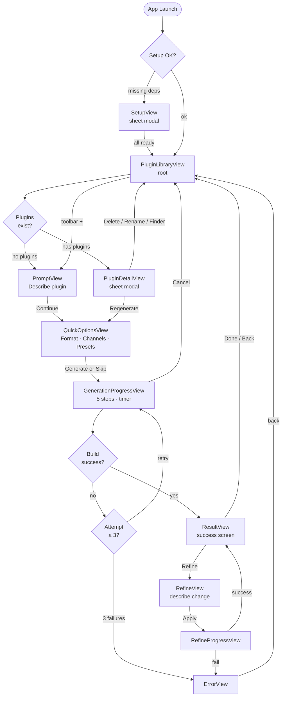
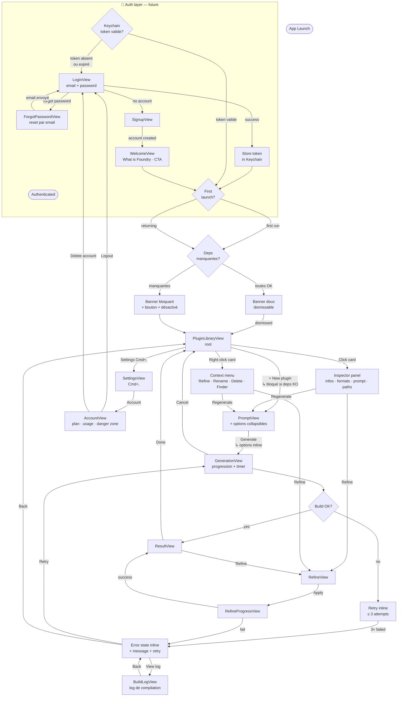

# Foundry — User Flows

## 1. Current Flow (as-is)

---

## 2. Improved Flow — Simple & Minimal (auth-ready)

**Principes directeurs :**
- Auth comme gate d'entrée unique (futur) — vérification Keychain silencieuse
- Setup inline avec deux états : avertissement doux (deps OK) vs bloquant (deps manquantes)
- Welcome screen au premier lancement post-signup
- Options de génération condensées dans PromptView (expandable)
- Inspector panel latéral pour le détail plugin (non intrusif)
- Build log accessible en cas d'erreur
- Error recovery inline dans GenerationView
- AccountView dédiée (plan, usage, danger zone)

---

## Delta résumé

| Aspect | Actuel | Amélioré |
|--------|--------|----------|
| Auth | ❌ absente | ✅ Keychain silencieux + Login/Signup/ForgotPassword |
| Welcome | ❌ absent | ✅ WelcomeView post-signup |
| Setup | Sheet modale unique | Banner doux ou bloquant selon état des deps |
| Options génération | Écran séparé (QuickOptionsView) | Section collapsible dans PromptView |
| Detail plugin | Sheet modale (PluginDetailView) | Inspector panel latéral non intrusif |
| Actions plugin | Via detail sheet | Context menu direct |
| Error recovery | Vue séparée (ErrorView) | État inline dans GenerationView |
| Build log | ❌ absent | ✅ BuildLogView accessible depuis l'erreur |
| Account | ❌ absent | ✅ AccountView (plan · usage · danger zone) |
| Logout | ❌ absent | ✅ via AccountView |
| Nombre d'écrans | 9 vues | 7 vues core + 4 auth (future) |
