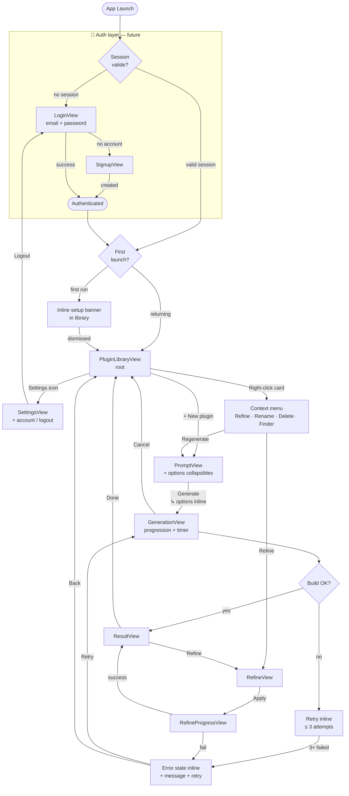

# Foundry — User Flows

## 1. Current Flow (as-is)

---

## 2. Improved Flow — Simple & Minimal (auth-ready)

**Principes directeurs :**
- Auth comme gate d'entrée unique (futur) — isolée du reste du flow
- Setup intégré inline au premier lancement post-auth (pas de sheet modale)
- Options de génération condensées dans PromptView (expandable, pas un écran séparé)
- Actions sur les plugins via menu contextuel direct (pas de sheet detail)
- Refine accessible depuis la library sans étape intermédiaire
- Error recovery inline dans la vue de progression

---

## Delta résumé

| Aspect | Actuel | Amélioré |
|--------|--------|----------|
| Auth | ❌ absente | ✅ gate d'entrée isolée (future) |
| Setup | Sheet modale | Banner inline dismissable |
| Options génération | Écran séparé (QuickOptionsView) | Section collapsible dans PromptView |
| Actions plugin | Sheet detail → actions | Menu contextuel direct |
| Error recovery | Vue séparée (ErrorView) | État inline dans GenerationView |
| Refine depuis library | Via detail sheet | Via context menu direct |
| Logout / account | ❌ absent | ✅ via Settings |
| Nombre d'écrans | 9 vues | 6 vues core + 2 auth (future) |
